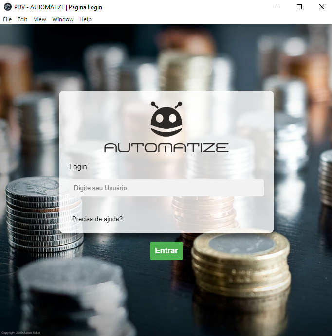

# Automatize_PDV




### Ajustes e melhorias

O projeto ainda está em desenvolvimento e as próximas atualizações serão voltadas nas seguintes tarefas:

#### FRONT
- [x] Tela de Login
- [x] Tela de Menus
- [ ] Tela de Vendas
- [ ] Tela de Estoque
- [ ] Tela de Cadastro de Cliente

## 💻 Pré-requisitos

Antes de começar, verifique se você atendeu aos seguintes requisitos:

* Você instalou a versão mais recente de `NodeJS, Electron`
* Você tem uma máquina `Windows`

  ## 🚀 Instalando <nome_do_projeto>

Para instalar o Projeto, siga estas etapas:

Windows:
```
npm init
npm run dev
```
